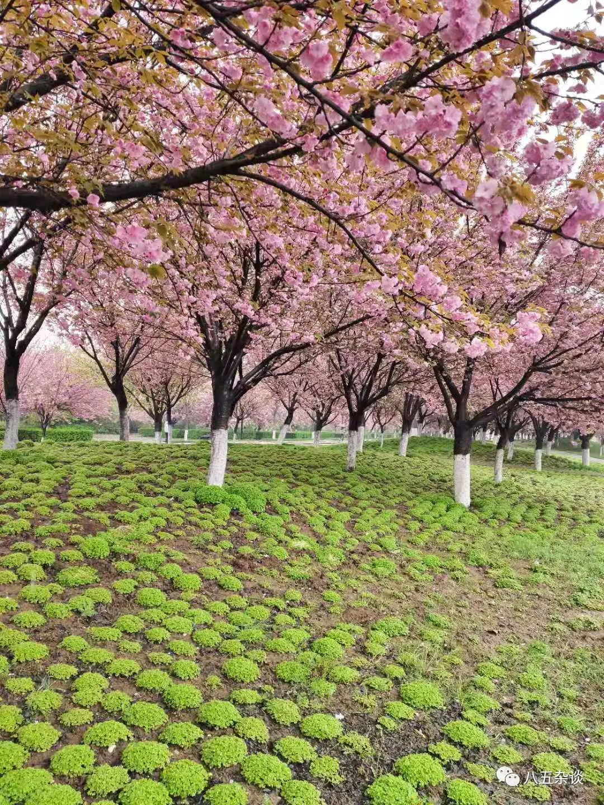

又到了每周复盘的时间，只有这段时间是为自己在活，真正能让自己静下心回顾一下这一周存在的价值

坐在言几又的桌子旁，喝着言几又30+的鲜榨西瓜汁，听着来来往往孩子的吵闹声，孩子家长充满焦虑的家常对话，看着言几又店员忙碌着收拾书籍的身影

也许这就是城市人周末的生活，真正属于这个城市人的生活

而我，只是这个城市的借住者，坐在这里装装样子罢了

还是需要多多感受生活的美好呀，惬意悠长又无虑

### 远方

这周的每天基本都泡在工作室了，忙着招新，忙着准备产品推广的物料

忙碌又充实，基本填补了我剩余的时间空地

招新办的不好不坏，也是比较无奈，再想不出什么更好的方法来招进更多的人

目前处于比较乏力的阶段

这周的每天晚上的日常就是与各种各样的人私聊

这是一件费事费时，转化率又十分低的事

也没有什么破局的好想法，那就按部就班的去做吧

4.2号，我们的产品全面推广了

效果还算不错吧，至少积累了部分数量的用户圈子

当然，前路漫漫，要做的还有很多，还需要不断的脚踏实地的去做呀

### 近况

假期进行两天了，还算比较充实吧，该逛的也逛了，买了三本书，开了个言几又的会员，这个假期的消费重点是书，对书我没办法吝色

看着我右上角满满当当的书架，别有一番成就感，到了现在这个阶段，越发觉得读书是对当前这个自己最有利的方法了。

完全可以感觉到自己处于一种瓶颈期，干坐着半天写不出自己想要表达的文案，无法专注其中

总结一下，就是读书让你进步，让你成长

突如其来的工作让我没办法专注创作，沙皮舍友又吵得不行，想爆粗口，还是要磨练下自己的性子

