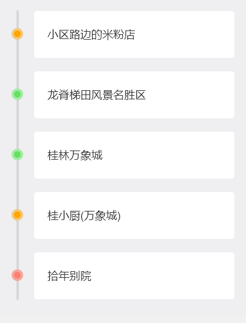
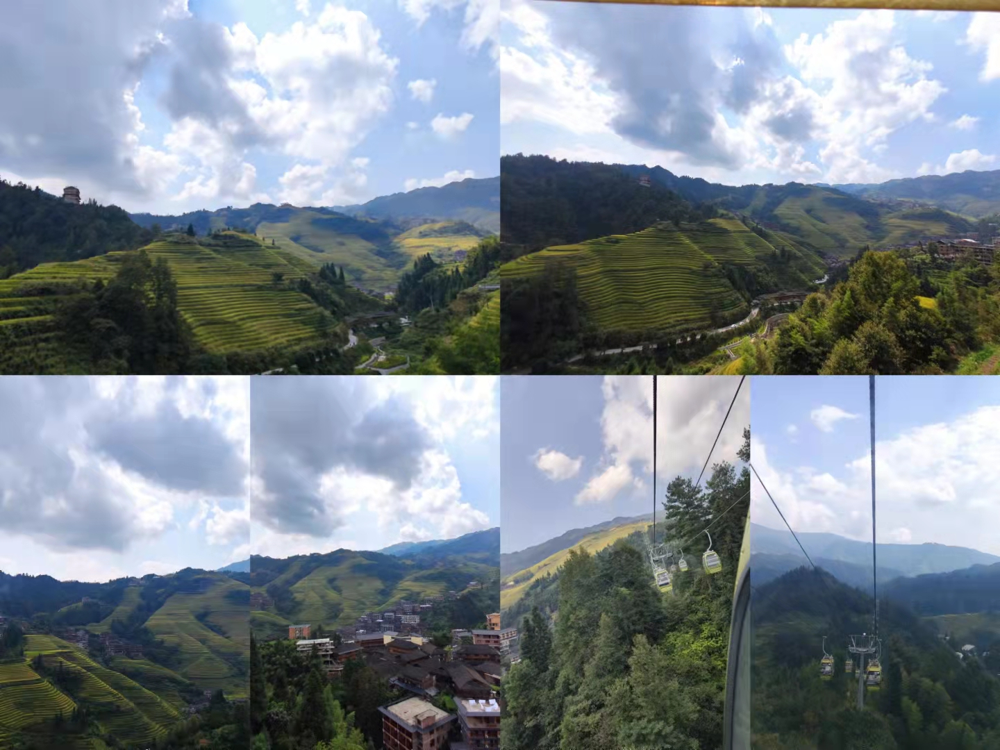
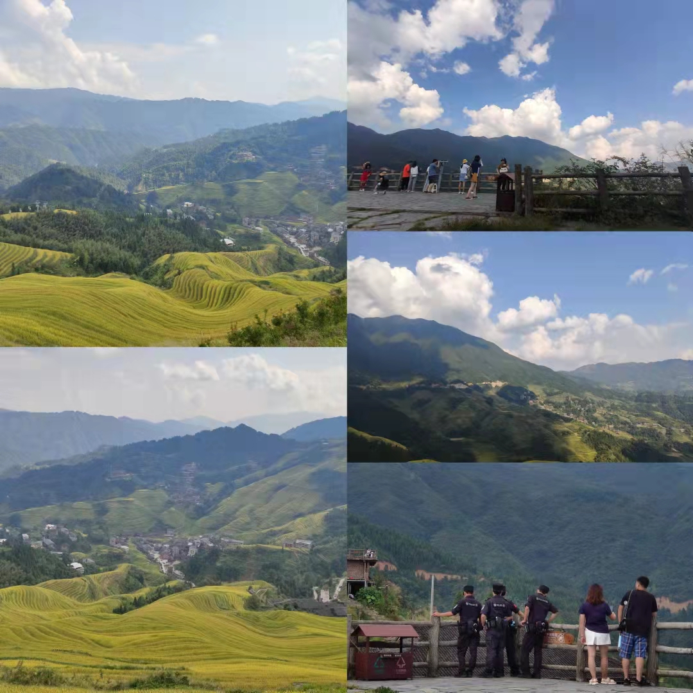
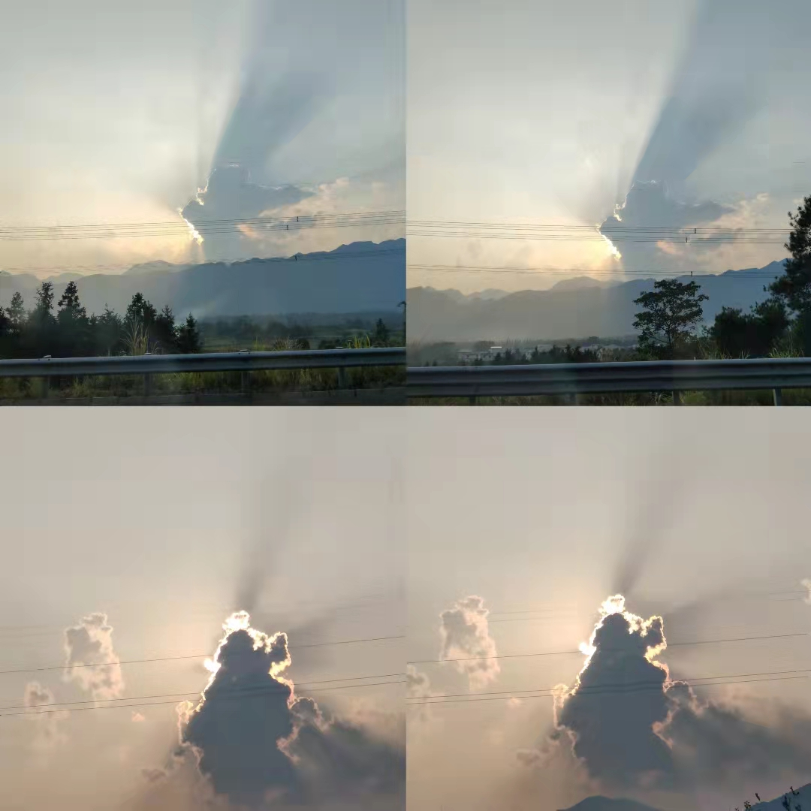

## Day2（10.1）

### 早9点

照例早晨一碗粉，今天吃的是民宿小区外的一家粉店，相较于其他比较火一点的店，这家店全是附近的本地人来吃，质量更能得到保障。桂林米粉点单攻略：有招牌点招牌，没招牌点二两。

.jpg)

好吃好吃！

这趟旅行的一开始，就发生了一件让人头疼的事，嘴里起溃疡了🙂，而且就在下嘴唇那里，每吃一口粉，为了把粉咬断，都需要用到上牙和下嘴唇，那就说明每次吃粉，粉都会和溃疡来数十次的亲密接触，疼。

>  口腔溃疡怎么治?
>
> 每个家庭兴许都有不同的办法，我们家也不例外，我妈让我吃维C和维b2，我爸让我往嘴里抹盐🥺
>
> 而我自己更喜欢两者综合的方法，取一片维C，放在伤口上，用嘴或者舌头压住它，可能会有个10S左右的阵痛，可是阵痛完就会大大减轻日常的疼痛，吃饭也不疼了，还好得快👍

### 早10点

从市区启程前往龙脊梯田，梯田原本不在我们的计划范围内，可是拼车时候遇到的老哥，民宿的管理者都向我们推荐这个时候去梯田看看，因为这个时候水稻正好到行将收割的阶段，绿中带黄，于是我们打算去瞧一瞧，西北人还没见过梯田长啥样子呢。

### 午12点

车程大概一个半小时左右，有高速，进景区之后是漫长的山路。走到一个桥附近，看见有卖竹筒饭，正好也饿了，于是靠边停车休整一下。

.jpg)

烤竹筒饭的妹子是在桂林上大学的学生，放假回家帮家里照顾生意。

竹筒起开后，看着里面这饭怎么有点似曾相识🤣，这不是新疆的抓饭么，只不过把羊肉换成了腊肉，但，尝过之后，还是想说声打扰了，不像新疆的抓饭粒粒分明，竹筒饭是黏糯型的，而且好像没放盐，总之有点预期违背，但碰到妹子问我们好不好吃，我只能说好吃好吃。

在小溪上有一座桥，连接两座山，坐在桥上，穿堂而过的山风很是舒爽，卖竹筒饭的一家和周边的居民都是壮族，穿着很有特点，可惜忘记拍照了。

.jpg)

继续出发，前往最大的梯田。山路很抖，也经常会和很多大巴车会车，狭路相逢，还是我让大巴为妙🙃，怎么说也把车技磨练出来了。

又开了将近半个多小时，进梯田的时候大排长龙，有不少人是提着大包小包的来这里，估计是想常住沙家浜，纯粹是来这里体验山水风光的。

.jpg)

### 午13点

排了一会，我们也进去了。停好车之后，向梯田进发

> 龙脊梯田
>
> 门票：80/人（学生票40/人（出示学生证））
>
> 缆车：有不同的票价，往返100/人，单程50/人，学生票统统砍半
>
> 推荐指数：🌟🌟🌟🌟🌟
>
> 梯田观景台在山的最高点，如果不坐缆车，从停车场步行上去得花一个小时，我们老年人还是乖乖坐缆车吧

.jpg)

不得不说，风景绝对是一流，和新疆天山不一样的感觉。

坐了半个多小时就登顶了，上山之后就是一顿拍拍拍

.jpg)

想模仿壮族人唱山歌的样子，结果表情管理没做好，像个吃小孩的二愣子。

天气十分的给力，照的水稻金灿灿的，云也都十分好看，站在山顶的我非常想给谁甩个视频，想来想去还是给爸妈打了一个，美景总要有人一起来分享。

坐在山顶的凉亭里歇脚，起初特想抽一根烟，面对诱惑，一定要坚持达咩🙅‍♂️

但是，看过美景之后的贤者时间，配上一根烟也不失为好选择。于是，就，点了一根，看着风景，嘬着烟，快乐似神仙。

但好景不长，烟抽了一半，一堆警察也来山顶了，还真是山上一把火，所长爱上我？速速的把烟往地上一扔，一顿狂踩，事后去看我踩过的烟，都扁的像一张纸了🤣，可见我真是怂的不行。

这些警察上来后东看看西望望，感觉像是组团来旅游的，看了看又下山去了。

快乐够了，我们也打算下山返程，在下山的缆车上碰到一对关系不明的男女，男1的谈吐举止很像罗翔，女1的像是一个傻白甜，男的职业是律师，女的职业是护士，还是西安的。tjy的搭讪打开了男1的话匣子，我对这个年龄的陌生人完全没有沟通的欲望，只想安安静静的看窗外，他们聊大学，聊专业，聊历史，快窒息了😑。感觉像是上了一堂课一样，不愧是律师，叭叭叭可以一直说。

### 午16点

开车返程了，计划在太阳落山前抵达桂林。在返程的高速上，拍到了一直想拍的圣光。

### 晚18点

到了桂林万象城，一是陪tjy给他朋友挑礼物，二是晚上恰饭。

给他提了好多礼物的建议，最终还是采纳了送绘本的建议。一进书店还是克制不了买书的欲望，买了两本，一个绘本一个flipped的中英版。

这个绘本超有意思，脑洞很大，好多梗我都接不住，留着日后慢慢探索。

为什么要买flipped呢？我也不知道，可能因为电影里的女主不太正吧（bushi）

.jpg)

### 晚20点

晚餐是在万象城里的一家广西菜馆吃的

> 餐厅名称：桂小厨
>
> 餐厅位置：桂林市秀峰区红岭路1号桂林万象城第4层
>
> 推荐指数：🌟🌟🌟
>
> 人均消费：110+
>
> 妥妥商业化后的连锁店，没什么特色，菜味道也一般，价格还不低

.jpg)

### 晚22点

回到民宿，去一楼尝了一杯他们自己酿的青梅酒，记得之前看《海街日记》的时候，看着长泽雅美喝青梅酒就馋的不行，于是去接了一杯尝尝看。

.jpg)

不太会品酒，也没什么形容词来形容味道，一个字：好喝！

---

这就是Day2的全部行程啦，充实，peace😉
